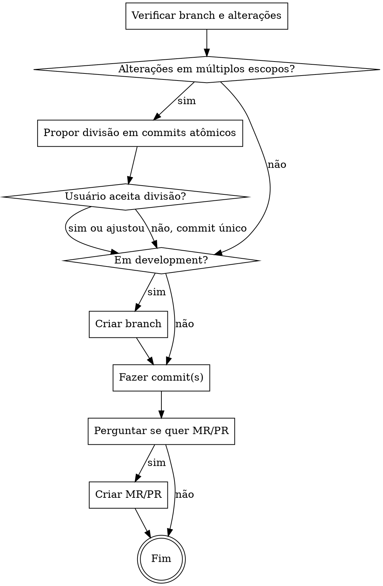

# Commit em Português

## Fluxo



## Regras

1. **Tag em inglês**: `fix`, `feat`, `chore`, `docs`, `refactor`, `test`, `style`, `perf`, `ci`, `build`
2. **Mensagem em português**: Título e descrição sempre em português
3. **Não alterar código**: Apenas criar o commit, nunca modificar arquivos
4. **Pre-commit falhou**: Reportar o erro exato. Não propor soluções. Não tentar corrigir.
5. **Commits atômicos**: Sempre analisar escopo e propor divisão quando apropriado

## Análise de Escopo (SEMPRE fazer primeiro)

Antes de qualquer commit, analisar `git status` e `git diff --stat` para identificar grupos lógicos:

| Critério para dividir | Exemplo |
|----------------------|---------|
| Módulos diferentes | `app/modulos/opm/` vs `app/modulos/periodo_glo/` |
| Camadas diferentes | infraestrutura vs casos de uso vs testes |
| Funcionalidades independentes | storage vs autenticação vs rotas |
| Tags diferentes | `feat` vs `refactor` vs `chore` |

### Quando propor divisão

- **2+ grupos lógicos distintos** → propor divisão
- **1 grupo coeso** → commit único

### Formato da proposta

Apresentar tabela com divisão sugerida:

```
| # | Tag | Escopo | Arquivos principais |
|---|-----|--------|---------------------|
| 1 | feat | Storage MinIO/S3 | app/core/storage/, docker-compose.yml |
| 2 | refactor | Módulo OPM | app/modulos/opm/ |
| 3 | chore | Ajustes gerais | conftest.py, docs/ |

Quer seguir essa divisão ou prefere ajustar?
```

### Respostas do usuário

| Resposta | Ação |
|----------|------|
| `sim`, `s`, `yes` | Seguir divisão proposta |
| `não`, `n`, `no` | Commit único com tudo |
| `<ajuste específico>` | Adaptar conforme pedido |

## Branch automática (apenas em development)

Quando em `development`, criar branch antes de commitar:

| Cenário | Nome da branch |
|---------|----------------|
| Usuário informou nome | Usar exatamente como informado |
| Usuário informou descrição | `<tag>/<slug-da-descrição>` |
| Sem informação | `<tag>/<slug-do-título-do-commit>` |

**Slug**: lowercase, palavras separadas por hífen, sem acentos, max 50 chars.

**Exemplo**: alterações de fix com título "corrigir autenticação JWT" → branch `fix/corrigir-autenticacao-jwt`

## Formato do commit

```
<tag>: <título em português>

<descrição em português, se necessário>
```

## Exemplo completo

```bash
# Se em development, primeiro:
git checkout -b fix/corrigir-healthcheck-postgres

# Depois o commit:
git commit -m "fix: corrigir healthcheck do postgres para usar usuário correto

pg_isready sem -U usa o usuário do sistema (root), causando erro
\"role root does not exist\"."
```

## Quando Pre-commit Falhar

```
Pre-commit falhou:

<saída exata do erro>

Nenhuma alteração foi commitada.
```

**PARE.** Não sugira correções. Não altere arquivos. Apenas reporte.

## Após o Commit

Sempre perguntar se quer abrir MR/PR:

```
Commit criado. Deseja abrir um MR/PR para development? (s/n/outra-branch)
```

**Respostas do usuário:**
| Resposta | Ação |
|----------|------|
| `s`, `sim`, `yes`, `padrão`, `development` | Criar MR para `development` |
| `n`, `não`, `no` | Não criar MR |
| `<nome-branch>` | Criar MR para a branch informada |

**Regras do MR/PR:**
- Target padrão: `development`
- **NUNCA** permitir MR/PR direto para `main`
- Se usuário pedir para `main`, avisar e sugerir `development`
