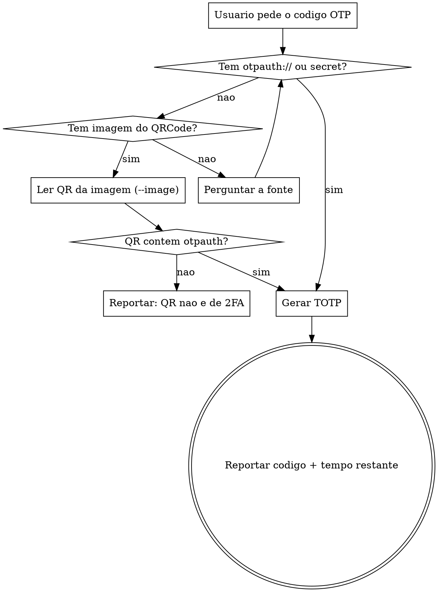

# QRCode OTP

Extrai o secret de um QRCode de 2FA (URI `otpauth://totp/...`) e gera o codigo **TOTP** de 6 digitos, valido por uma janela de tempo (padrao 30s). Aceita tanto uma **string otpauth://** quanto uma **imagem** contendo o QRCode.

> Trata apenas **TOTP** (baseado em tempo). HOTP (baseado em contador) nao e suportado.

## Pre-requisito

Os scripts rodam com Node.js. Para gerar codigo a partir de uma **string** otpauth ou de um **secret**, nao ha dependencias (usa `crypto` nativo).

Para ler QRCode de uma **imagem**, instale as dependencias uma vez:
```
! cd /home/shedy/git/skills/qrcode-otp/scripts && npm install
```

## Fluxo



## Coleta de Entrada

Identifique a fonte na mensagem do usuario. Pergunte **apenas se nao estiver claro**:

- **URI otpauth://** — cole direto. Contem secret, issuer, algoritmo, digitos e periodo.
- **Secret base32** — o texto que aparece abaixo do QRCode (ex.: `JBSWY3DPEHPK3PXP`). Usa os padroes: 6 digitos, 30s, SHA1.
- **Imagem** (PNG/JPG) — caminho de um arquivo com o QRCode. Requer `npm install` (ver acima).

## Uso dos Scripts

Todos a partir de `/home/shedy/git/skills/qrcode-otp/scripts`.

**A partir de uma string otpauth://** (sem dependencias):
```bash
node otp.mjs "otpauth://totp/Acme:alice?secret=JBSWY3DPEHPK3PXP&issuer=Acme"
```

**A partir de um secret base32** (com parametros opcionais):
```bash
node otp.mjs --secret JBSWY3DPEHPK3PXP --digits 6 --period 30 --algorithm SHA1
```

**A partir de uma imagem** (requer deps instaladas):
```bash
node otp.mjs --image /caminho/do/qrcode.png
```

**Saida estruturada** (para inspecionar issuer, algoritmo, tempo restante):
```bash
node otp.mjs --image /caminho/qr.png --json
```

## Cofre — reutilizar secrets entre sessoes

O secret pode ser salvo em um cofre local para gerar codigos em sessoes futuras sem reler o QRCode. O cofre fica em `~/.local/share/qrcode-otp/vault.json` (respeita `XDG_DATA_HOME`), **fora do repositorio versionado**, com permissao `600` (so o dono le). Cada conta e guardada por um **nome** escolhido por voce.

```bash
# salvar ao ler (funciona com --image, --uri/otpauth:// ou --secret):
node otp.mjs --image qr.png --save github
node otp.mjs --secret KRSXG5CTMVRXEZLU --save aws

# gerar o codigo de uma conta salva:
node otp.mjs --use github
node otp.mjs --use github --json

# listar contas salvas (mostra nome, issuer/label e parametros — NUNCA o secret):
node otp.mjs --list

# remover uma conta:
node otp.mjs --remove github
```

`--save` grava o secret e ja gera o codigo na mesma execucao. Ao usar `--use`, digits/period/algorithm vem do que foi salvo.

> O cofre guarda o secret em **texto plano**, protegido apenas pela permissao de arquivo (`600`). Nunca commite `vault.json` nem o copie para dentro do repositorio. Se a maquina for compartilhada ou o secret vazar, revogue o 2FA no provedor e refaca o setup.

Saida padrao: o codigo de 6 digitos na stdout e `(valido por mais Ns)` na stderr. Reporte ao usuario o **codigo** e **quanto tempo ainda e valido** — se faltarem poucos segundos, avise que um novo codigo esta prestes a ser gerado.

## Parametros TOTP

| Parametro | Default | Vem da URI otpauth |
|-----------|---------|--------------------|
| `secret` | (obrigatorio) | `?secret=` |
| `digits` | 6 | `?digits=` |
| `period` | 30 (segundos) | `?period=` |
| `algorithm` | SHA1 | `?algorithm=` (SHA1/SHA256/SHA512) |

Ao usar `--image` ou a URI, esses valores sao lidos automaticamente. Ao usar `--secret` puro, os defaults sao aplicados (cobrem a grande maioria dos provedores).

## Seguranca — o secret e sensivel

O `secret` do TOTP e equivalente a uma senha permanente: quem o tem gera codigos validos para sempre. Portanto:

- **Nunca** grave o secret nem a URI otpauth em arquivos **versionados**, logs ou historico de commits. O cofre (`--save`) e a unica excecao: fica fora do repo, em `~/.local/share/qrcode-otp/vault.json` com chmod 600.
- Prefira passar a **imagem** (`--image`) a colar o secret em texto, quando possivel.
- Nao ecoe o secret de volta ao usuario sem necessidade; reporte apenas o **codigo de 6 digitos** gerado. O `--list` nunca imprime o secret.
- Se o secret aparecer em uma mensagem, trate-o como credencial: nao o repita em resumos.
- O `vault.json` guarda os secrets em texto plano: qualquer processo rodando como o seu usuario consegue ler. Nao use em maquina compartilhada sem cuidado.

## Exemplo de Uso

Usuario: "gera o codigo desse QR" (anexa `qr.png`)

1. Detectar fonte: imagem → `qr.png`.
2. Garantir deps: se `--image` falhar por dependencia, instruir `npm install` em `scripts/`.
3. Rodar: `node otp.mjs --image qr.png --json`.
4. Reportar: "Codigo: **287082** (valido por mais 18s, issuer Acme)."
