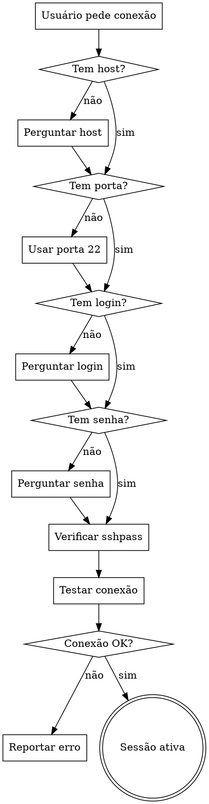

# SSH Remote

Executa comandos em máquinas remotas via `sshpass` + `ssh`. Mantém sessão ativa durante a conversa.

## Pré-requisito

`sshpass` deve estar instalado. Se não estiver, instrua o usuário:
```
! sudo apt install -y sshpass
```

## Fluxo



## Coleta de Credenciais

Pergunte **apenas o que faltar**. Se o usuário já informou host, porta, login ou senha na mensagem, use diretamente. Use `AskUserQuestion` para perguntar campos ausentes.

- **Host**: obrigatório (IP ou hostname)
- **Porta**: default `22` se não informada
- **Login**: obrigatório
- **Senha**: obrigatório

## Teste de Conexão

Após coletar credenciais, verifique se `sshpass` está disponível e teste com:

```bash
sshpass -p '<SENHA>' ssh -o StrictHostKeyChecking=no -o ConnectTimeout=10 <LOGIN>@<HOST> -p <PORTA> "hostname && whoami"
```

Se falhar, reporte o erro exato e pergunte se o usuário quer corrigir algum dado.

## Sessão Ativa

Após conexão bem-sucedida, entre em modo sessão:

- Lembre host, porta, login e senha para a duração da conversa
- Cada comando do usuário é executado via: `sshpass -p '<SENHA>' ssh -o StrictHostKeyChecking=no <LOGIN>@<HOST> -p <PORTA> "<COMANDO>"`
- Use timeout de 30 segundos por padrão (ajustável se o usuário pedir)
- Reporte a saída do comando ao usuário
- A sessão encerra quando o usuário pedir explicitamente ("desconectar", "sair", "encerrar sessão")

## Comandos Destrutivos — BLOQUEADOS

NUNCA execute diretamente comandos que possam causar dano ao sistema remoto. Antes de executar, verifique se o comando contém algum dos padrões abaixo.

### Lista de bloqueio (verificar comando E argumentos)

| Padrão | Motivo |
|--------|--------|
| `rm -rf /` ou `rm -rf /*` | Apaga sistema inteiro |
| `rm -rf` com caminhos de sistema (`/etc`, `/usr`, `/var`, `/boot`, `/home`, `/lib`, `/bin`, `/sbin`, `/opt`, `/root`) | Apaga diretórios críticos |
| `mkfs` | Formata disco |
| `dd if=` com `of=/dev/` | Sobrescreve dispositivo |
| `:(){ :\|:& };:` ou fork bomb | Trava o sistema |
| `shutdown`, `reboot`, `poweroff`, `halt`, `init 0`, `init 6` | Desliga/reinicia máquina |
| `chmod -R 777 /` ou `chmod -R` em caminhos de sistema | Quebra permissões |
| `chown -R` em caminhos de sistema | Altera dono de diretórios críticos |
| `> /dev/sda` ou escrita direta em devices | Corrompe disco |
| `iptables -F` ou `iptables -X` | Apaga regras de firewall |
| `systemctl stop sshd` ou `service ssh stop` | Mata a própria conexão |
| `kill -9 1` ou `kill -9 -1` | Mata processos críticos |
| `userdel`, `deluser` para o próprio usuário da sessão | Remove o próprio acesso |
| `passwd` (sem ser consulta) | Altera senhas |

### Comportamento ao detectar comando destrutivo

1. **NÃO execute o comando**
2. Informe ao usuário: "Comando bloqueado por segurança: `<comando>`. Motivo: `<motivo>`"
3. Pergunte se o usuário realmente quer executar e avise dos riscos
4. Só execute se o usuário confirmar explicitamente com ciência dos riscos

### Comandos seguros — exemplos

Estes comandos são sempre seguros de executar:
- `ls`, `cat`, `head`, `tail`, `less`, `find`, `grep`, `wc`
- `ps`, `top -bn1`, `htop`, `free`, `df`, `du`, `uptime`, `who`, `w`
- `hostname`, `uname`, `whoami`, `id`, `groups`
- `systemctl status`, `service status`, `journalctl`
- `ip a`, `ifconfig`, `netstat`, `ss`, `ping`, `traceroute`, `dig`, `nslookup`
- `docker ps`, `docker logs`, `docker inspect`
- `apt list`, `dpkg -l`, `pip list`, `npm list`

## Aviso de Segurança

Na primeira conexão, informe ao usuário:

> **Aviso:** A senha é passada via linha de comando (`sshpass`), o que pode ser visível no histórico de processos da máquina local. Para uso em produção, prefira chaves SSH.

## Exemplo de Uso

Usuário: "conecta na máquina 10.0.0.5 porta 22 login admin senha 1234"

1. Detectar credenciais na mensagem: host=10.0.0.5, porta=22, login=admin, senha=1234
2. Verificar `sshpass`
3. Testar conexão
4. Reportar sucesso e entrar em modo sessão
5. Aguardar comandos do usuário
